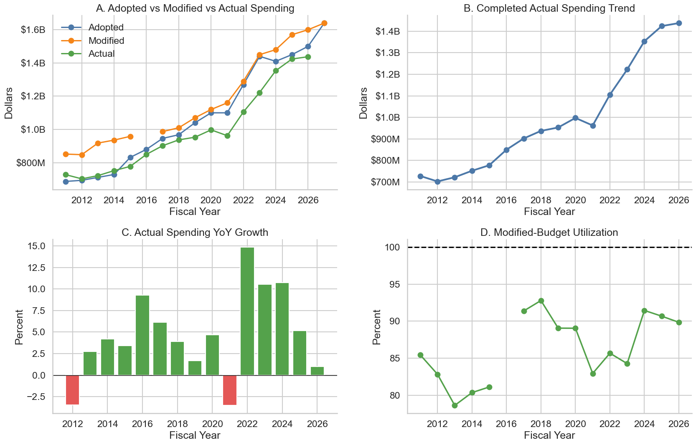
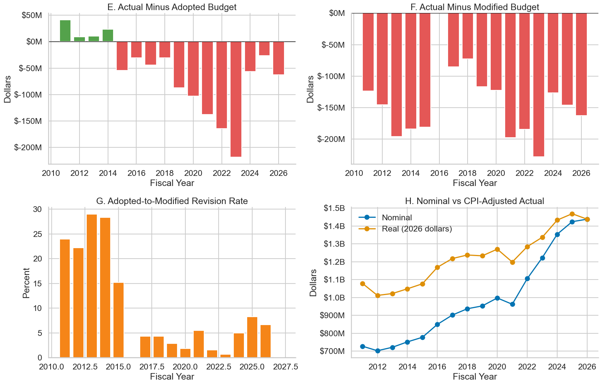
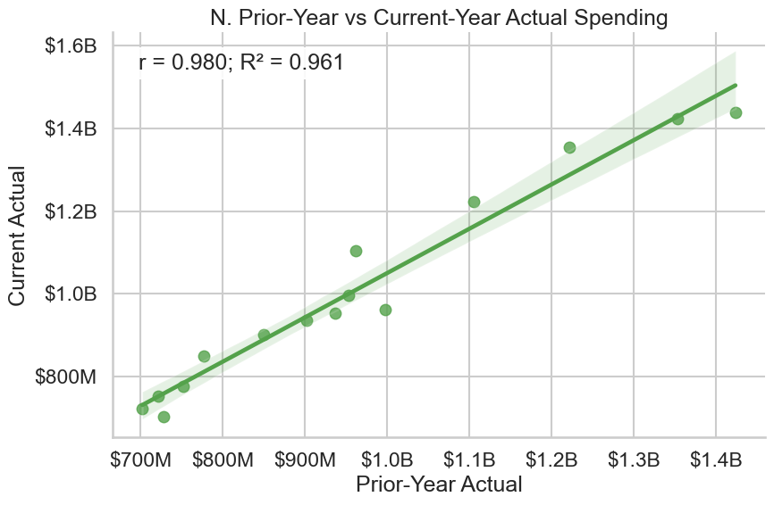
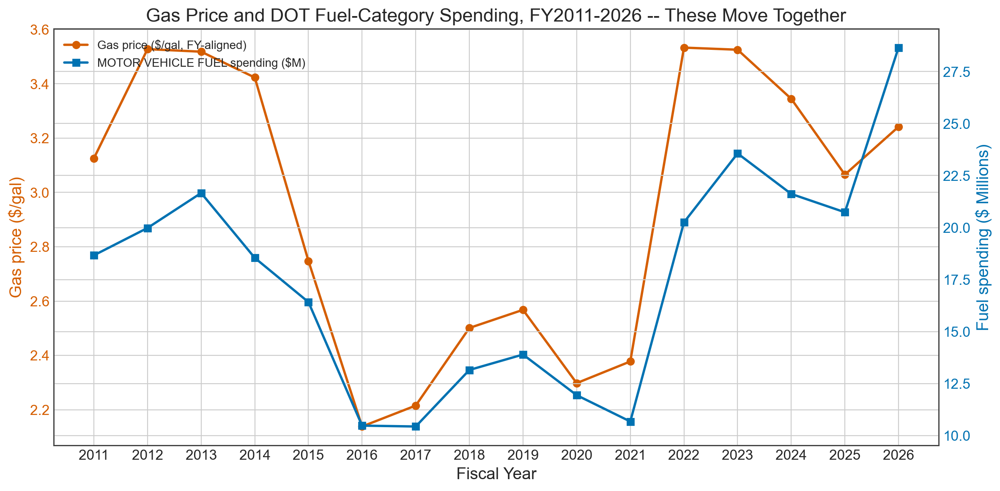
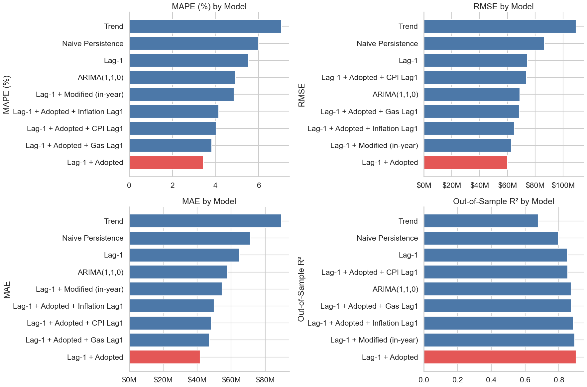
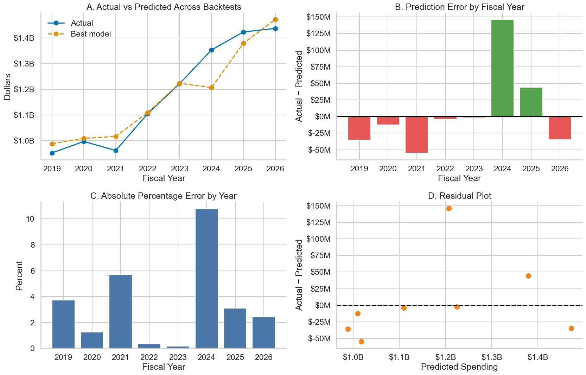
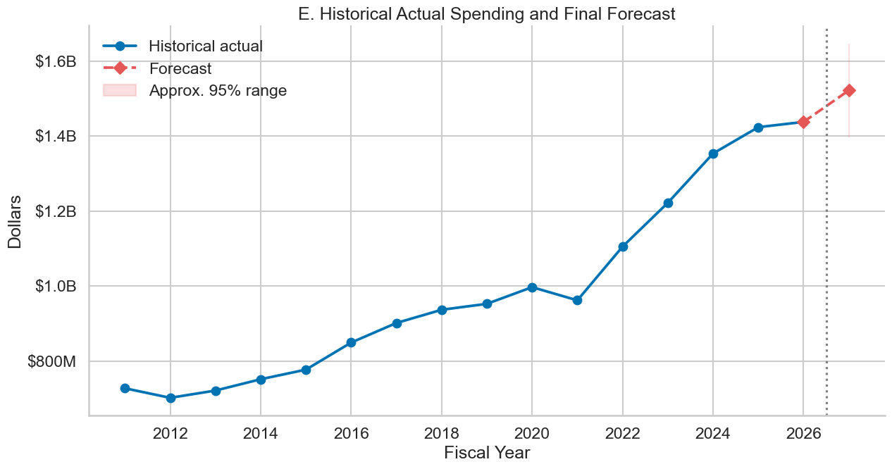

# NYC DOT Budget Analysis: Planned vs. Actual, FY2011–2027

This project builds a transparent, leakage-safe forecasting workflow for the NYC Department of Transportation's operating budget. It reconciles what was **adopted**, what was **modified** in-year, and what was actually **spent** across seventeen fiscal years, corrects two scope errors found in the raw source files, and tests whether next year's spending can be forecast using only information a planner would actually have on hand at the start of the year.

*Adopted, modified, and actual operating spending tracked together over 17 fiscal years, alongside year-over-year growth and modified-budget utilization — the baseline view every other finding builds on.*

*Actual spending against adopted and modified budgets, the in-year revision rate, and nominal vs. CPI-adjusted ("real") spending side by side — the real-vs-nominal gap here is the evidence behind the inflation finding below.*

## Key Findings

- **Spending efficiency is consistently high but never complete.** Actual spending lands at **83%–93% of the modified budget** every completed fiscal year (FY2017–FY2026) — DOT reliably executes most of what it's allocated, but a real funding gap remains every year.
- **Roughly 52–60% of nominal budget growth is inflation, not real expansion.** Nominal spending grew at a **4.6% CAGR**, but CPI-adjusted ("real") spending grew at only **1.9% CAGR** — about 59% of the nominal increase is the general price level rising, not the agency doing more.
- **Gas prices don't move the total budget, but they strongly predict fuel-category spending.** Gas price vs. DOT's *agency-total* spending is weak and statistically insignificant (r = 0.13–0.21) and doesn't survive detrending. But narrowed to the `MOTOR VEHICLE FUEL` expense category alone, the relationship is strong (r = +0.87 level) and **gets stronger after detrending (r = +0.90 on year-over-year % change)** — the opposite of a spurious pattern. The agency-total null result was aggregation masking a real, category-level effect.
- **Actual spending is persistence-driven: last year beats a trend line.** Prior-year actual spending correlates with current-year actual at **r = 0.980** (in-sample R² = 0.961). A model combining prior-year actual with the current adopted budget beat every trend-based and external-variable alternative out of sample.

*Prior-year actual spending vs. current-year actual spending, FY2012–FY2026 — the near-linear relationship (r = 0.980) that makes persistence such a strong forecasting baseline.*

*Gas price and `MOTOR VEHICLE FUEL` category spending move together year to year — a relationship invisible at the agency-total level but clear (and detrend-robust, r = +0.90) once isolated to the fuel expense category.*

## The Data & Corrections

Two scope errors in the raw source files would have silently distorted every downstream number if left uncorrected:

1. **FY2022 multi-agency contamination.** Every fiscal year's budget source file was pre-filtered to DOT rows only — except FY2022, which shipped with **~150 other NYC agencies' rows mixed in** (Health, Education, Police, pension and reserve funds, and more), inflating FY2022 Adopted from a plausible ~$1.3B to an implausible ~$100.6B. **Fix:** every budget row is filtered to `Agency == "Department of Transportation"` before aggregation, applied uniformly across all years (not just FY2022) so the correction is consistent rather than a one-off patch.
2. **Expense-vs-capital scope mismatch.** The raw spending (Checkbook) file mixes operating-expense and capital transactions (construction, bridge hazard-mitigation project codes, etc.), while the budget file is expense-only. Comparing them directly would compare mismatched scopes. **Fix:** spending rows are kept only when their Budget Code matches a code that actually appears in DOT's own operating budget file (`Payroll Summary` is retained separately, since its early records don't share that code format but are legitimate operating expense).

Both fixes are applied before any aggregation, and FY2027 — barely underway at the time of analysis (its actual is **9.9% of its modified budget**) — is retained for context but excluded from every completed-year KPI, correlation, and validation result so a partial year never gets mistaken for a complete one.

## Forecasting Approach

Models are evaluated strictly out of sample: an **expanding-window backtest** starting FY2019 and rolling one year at a time through FY2026, plus a simple holdout (train through FY2023, test FY2024–FY2026). No random splits — every test respects fiscal-year chronology, and only information available at the start of a forecast year is used as input.

Nine candidate specifications were compared, from a plain year trend and naive prior-year persistence, through combinations of lagged actual spending with the adopted or modified budget, lagged CPI/inflation/gas price, and a fixed ARIMA(1,1,0) benchmark.

*Out-of-sample MAPE, RMSE, MAE, and R² across all nine candidate models — **Lag-1 + Adopted** (prior-year actual plus the current adopted budget) wins on every metric, and none of the lagged external variables (CPI, inflation, gas) improve on it.*

The selected model — **prior-year actual spending combined with the current adopted budget** — achieves **3.44% MAPE**, **$41.8M MAE**, **$60.2M RMSE**, and **0.902 out-of-sample R²**, a **42.5% MAPE improvement over naive persistence** (repeating last year's number unchanged). That comparison against the naive baseline, not the raw accuracy score alone, is the honest test: the model has to beat "just use last year's actual," and it does, by a wide and stable margin.

*Backtest diagnostics for the selected model — errors are small, don't trend over time, and show no strong residual pattern, which is what "the model generalizes" looks like rather than just having a low headline score.*

*Historical actual spending refit on all completed years, with the FY2027 forecast (~$1.52B) and an approximate 95% interval. FY2028–FY2029 are intentionally not forecast — no adopted-budget input exists yet for those years, and inventing one would undermine the model's business meaning.*

## Recommendations

1. **Anchor the initial budget estimate in the latest completed actual.** The Lag-1 relationship and every chronological validation test confirm prior-year spending is the strongest single predictor available.
2. **Combine prior-year actual with the adopted budget**, not either alone — this simple, explainable model was competitive with every more complex alternative tested, joining operational continuity with current-year policy intent.
3. **Monitor adopted-to-modified revisions and utilization at consistent fiscal-year cutoffs** so a partial year in progress is never mistaken for underspending.
4. **Report nominal and CPI-adjusted (real) trends side by side** for any multi-year planning discussion — roughly half of headline budget growth is inflation, not expanded scope of work.
5. **Use CPI, inflation, and gas price selectively, and keep the negative results.** None improved the agency-total forecast in this analysis; if fuel-category forecasting is developed separately, model gas price there, where the relationship is real.
6. **Separate recurring operating expense from capital and one-time project spending** before building or refreshing any model, and refresh an in-year model only once modified budgets and current-year spending are genuinely available.

## Methodology Note & Limitations

- **Correlation is descriptive, not causal**, throughout this analysis — including the gas-price/fuel-spending relationship. Fuel spending reflects price *and* quantity purchased (fleet size, miles driven, snow-plowing intensity); gallons data isn't available to separate the two, so the finding is consistent with a price effect but doesn't isolate one.
- **Small annual sample.** Validation is based on well under twenty annual observations (fewer once lagged), split chronologically rather than randomly. P-values and R² should be read as supporting evidence, not proof, and the model was deliberately kept simple rather than tuned to this sample.
- **FY2027 is excluded from every completed-year KPI, correlation, and validation result** because it is a partial year in progress, not a data error — including it would corrupt every average and every backtest it touched.
- **FY2028–FY2029 are not forecast.** No adopted-budget input exists yet for those years, and the forecasting approach here deliberately avoids inventing scenario assumptions to fill that gap.
- **Both data corrections (FY2022 agency scope, expense-vs-capital scope) are applied uniformly across all fiscal years**, not as one-off patches to the years where they were first noticed, so the corrected series stays internally consistent.

---

*Part of the [NYC Budget Allocation](https://github.com/lindali-huishan/NYC_Budget_Allocation) project. Source notebooks and data live in the repo's `DOT/` directory.*
